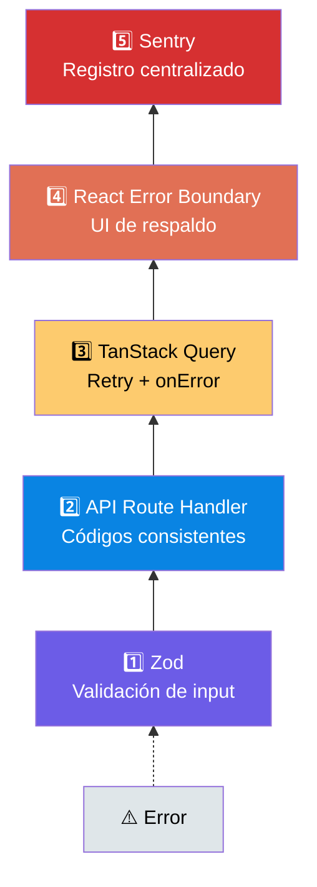

# ⚠️ Estrategia de Error Handling

Manejo de errores en 5 capas que cubre desde la validación de input hasta el registro centralizado.

---

## Visión General: 5 Capas



Flujo completo: `Input → Zod → API → TanStack Query → Error Boundary → Sentry`

---

## Capa 1: Zod — Validación de Input

Zod valida los datos de entrada en el servidor (API routes) y en el cliente (formularios). Si los datos no cumplen el esquema, se devuelve un error 400 con detalles específicos.

```ts
import { z } from 'zod'

const userSchema = z.object({
  email: z.string().email('Email inválido'),
  password: z.string().min(8, 'Mínimo 8 caracteres'),
})
```

---

## Capa 2: API Route Handler — Formato Consistente

Todas las API routes devuelven errores en formato plano y consistente:

```json
{ "error": "Email inválido", "code": "VALIDATION_ERROR", "details": [...] }
```

### Formatos de Respuesta

```ts
// Éxito
{ data: T }

// Error de validación (Zod)
{ error: "Email inválido", code: "VALIDATION_ERROR", details: { field: "email" } }

// Error de autenticación
{ error: "No autorizado", code: "UNAUTHORIZED" }

// Error de servidor
{ error: "Error interno", code: "INTERNAL_ERROR" }
```

---

## Capa 3: TanStack Query — Errores de Red/Server

TanStack Query retry automáticamente **3 veces** las queries fallidas, y expone estados para manejar errores:

```tsx
const { data, isError, error, refetch } = useQuery({
  queryKey: ['users'],
  queryFn: () => fetch('/api/users').then(r => r.json()),
  retry: 3,
  staleTime: 1000 * 60 * 5, // 5 min
})
```

### Mutations con manejo de errores

```tsx
const mutation = useMutation({
  mutationFn: createUser,
  onError: (error) => {
    toast.error(error.message)
    Sentry.captureException(error)
  },
})
```

---

## Capa 4: React Error Boundary — UI de Respaldo

Un Error Boundary es un componente de React que **atrapa errores de JavaScript** en el árbol de componentes hijos. Sin esto, si cualquier componente explota, **la app entera se cae** (pantalla blanca). Con Error Boundary:

```tsx
// src/components/ErrorBoundary.tsx
'use client'
import { Component, ErrorInfo, ReactNode } from 'react'
import * as Sentry from '@sentry/nextjs'

interface Props {
  children: ReactNode
  fallback?: ReactNode
}

interface State {
  hasError: boolean
  error: Error | null
}

export class ErrorBoundary extends Component<Props, State> {
  constructor(props: Props) {
    super(props)
    this.state = { hasError: false, error: null }
  }

  static getDerivedStateFromError(error: Error): State {
    return { hasError: true, error }
  }

  componentDidCatch(error: Error, info: ErrorInfo) {
    Sentry.captureException(error, { extra: info })
  }

  render() {
    if (this.state.hasError) {
      return this.props.fallback || (
        <div role="alert">
          <h2>Algo salió mal</h2>
          <p>Intenta recargar la página</p>
          <button onClick={() => this.setState({ hasError: false })}>
            Reintentar
          </button>
        </div>
      )
    }
    return this.props.children
  }
}
```

### Uso del Error Boundary

```tsx
<ErrorBoundary fallback={<p>Ups, error en el dashboard</p>}>
  <Dashboard />
</ErrorBoundary>
```

---

## Capa 5: Sentry — Registro Centralizado

Sentry captura todos los errores con stack trace completo y contexto. Se integra automáticamente con:

- **Error Boundaries**: cada error de render se envía a Sentry
- **TanStack Query mutations**: errores manualmente enviados
- **API routes**: errores no controlados capturados por middleware
- **Next.js**: integración nativa con `@sentry/nextjs`

---

## Resumen de la Estrategia

| Capa | Responsabilidad | Tecnología |
|------|----------------|------------|
| 1 | Validación de input | Zod |
| 2 | Formato de error consistente | API Route Handlers |
| 3 | Errores de red y server | TanStack Query (retry, onError) |
| 4 | UI de respaldo | React Error Boundary |
| 5 | Registro y monitoreo | Sentry |

> La UI de respaldo en Error Boundary (Capa 4) debe usar componentes del design system, no `<div>` y `<h2>` raw. Ver [Estándares de Diseño](/estandares-diseno.md).

## Referencias

- [Documentación API](/api-docs.md) — formato de respuesta de errores (flat: `{ error, code, details? }`)
- [Sentry](/sentry.md) — configuración y alertas del registro centralizado (Capa 5)
- [Errores al Usuario](/errores-usuario.md) — mapeo de códigos de error técnicos a mensajes amigables
- [Testing](/testing.md) — verificar los 5 estados de error en tests BDD E2E
- [Logging](/logging.md) — complemento: los errores 5xx también se registran en Pino
