# Fases del Ciclo de Vida SDD + BDD

El harness opera en **dos modos** según el tipo de solicitud:

| Modo | Cuándo | Fases activas |
|---|---|---|
| **11 fases completas** | Feature nueva, cambio significativo, impacto en arquitectura o datos | Fases 0 → 10 |
| **Flujo corto** | Bug fix, cambio menor, ajuste visual | Fases 0 → 5 → 6 → 7 → 9 |

Ver [`flujo-bugfix.md`](/fases/flujo-bugfix.md) para el detalle del flujo corto. En caso de duda, usar las 11 fases.

---

El harness orquesta **11 fases secuenciales**. Cada fase produce artefactos concretos y requiere un **gate humano explícito** (aprobación) antes de avanzar a la siguiente.

```mermaid
flowchart TB
    REQ["📥 Solicitud"] --> F0
    subgraph F0 [Fase 0: Intake]
        direction LR
        I0["Desambiguar alcance"] --> I1["Propuesta inicial"]
    end
    F0 --> G0{"Gate Humano"}
    G0 -->|✅ Aprueba| F1
    G0 -->|❌ Rechaza| REQ

    subgraph F1 [Fase 1: SDD Spec]
        direction LR
        S0["speckit.specify"] --> S1["spec.md"]
    end
    F1 --> G1{"Gate Humano"}
    G1 -->|✅ Aprueba| F2
    G1 -->|❌ Rechaza| F1

    subgraph F2 [Fase 2: Riesgos]
        direction LR
        R0["Threat model"] --> R1["Data model"]
    end
    F2 --> G2{"Gate Humano"}
    G2 -->|✅ Aprueba| F3
    G2 -->|❌ Rechaza| F2

    subgraph F3 [Fase 3: Arquitectura]
        direction LR
        A0["UX + Wireframes"] --> A01["API + DB + UI"] --> A1["Contratos + ADR borrador"]
    end
    F3 --> G3{"Gate Humano"}
    G3 -->|✅ Aprueba| F4
    G3 -->|❌ Rechaza| F3

    subgraph F4 [Fase 4: Tareas BDD]
        direction LR
        T0["Desglose"] --> T1["tasks.md"]
    end
    F4 --> G4{"Gate Humano"}
    G4 -->|✅ Aprueba| F5
    G4 -->|❌ Rechaza| F4

    subgraph F5 [Fase 5: Implementación BDD]
        direction LR
        B00["CI scaffold + health endpoint"] --> B0["RED"] --> B1["GREEN"] --> B2["REFACTOR"]
    end
    F5 --> G5{"Gate Humano"}
    G5 -->|✅ Aprueba| F6
    G5 -->|❌ Rechaza| F5

    subgraph F6 [Fase 6: Seguridad]
        direction LR
        C0["Zod + RBAC"] --> C1["Semgrep"]
    end
    F6 --> G6{"Gate Humano"}
    G6 -->|✅ Aprueba| F7
    G6 -->|❌ Rechaza| F6

    subgraph F7 [Fase 7: Testing]
        direction LR
        E0["Unit + E2E + a11y + Perf"] --> E1["Coverage + Lighthouse"]
    end
    F7 --> G7{"Gate Humano"}
    G7 -->|✅ Aprueba| F8
    G7 -->|❌ Rechaza| F7

    subgraph F8 [Fase 8: Monitoreo]
        direction LR
        M0["Sentry DSN + Alertas"] --> M1["Dashboard + Runbook"]
    end
    F8 --> G8{"Gate Humano"}
    G8 -->|✅ Aprueba| F9
    G8 -->|❌ Rechaza| F8

    subgraph F9 [Fase 9: CI/CD]
        direction LR
        D0["Pipeline endurecido"] --> D1["Deploy + Estrategia migrations"]
    end
    F9 --> G9{"Gate Humano"}
    G9 -->|✅ Aprueba| F10
    G9 -->|❌ Rechaza| F9

    subgraph F10 [Fase 10: Documentación]
        direction LR
        L0["ADRs completados + README"] --> L1["Runbook finalizado"]
    end
    F10 --> G10{"Gate Humano"}
    G10 -->|✅ Aprueba| DONE["🎉 Entregado"]
    G10 -->|❌ Rechaza| F10

    style REQ fill:#6C5CE7,color:#fff
    style DONE fill:#00B894,color:#fff
    style G0 fill:#FDCB6E,color:#000
    style G1 fill:#FDCB6E,color:#000
    style G2 fill:#FDCB6E,color:#000
    style G3 fill:#FDCB6E,color:#000
    style G4 fill:#FDCB6E,color:#000
    style G5 fill:#FDCB6E,color:#000
    style G6 fill:#FDCB6E,color:#000
    style G7 fill:#FDCB6E,color:#000
    style G8 fill:#FDCB6E,color:#000
    style G9 fill:#FDCB6E,color:#000
    style G10 fill:#FDCB6E,color:#000
```



## Stack

| Componente | Elección |
|---|---|
| Framework | Next.js 14+ (App Router) |
| Lenguaje | TypeScript strict |
| ORM | Prisma + Zod DTOs |
| Base de datos | PostgreSQL |
| Auth | Auth.js v5 |
| BDD | Playwright BDD |
| Testing | Vitest + MSW + SQLite en memoria |
| CI/CD | GitHub Actions → Vercel |
| Monitoreo | Sentry + Pino |
| Pre-commit | Husky + lint-staged + Semgrep |

## Tipos de Gate

| Tipo | Cuándo para | Fases |
|---|---|---|
| **Siempre-stop** | El agente siempre espera aprobación explícita | 0, 3 (solo UX), 9 |
| **Condicional** | Para solo si hay bloqueo, hallazgo o decisión que el agente no puede tomar solo | 1, 2, 3 (arquitectura), 4, 5, 6, 7, 8, 10 |

En los gates condicionales, si todo está verde el agente avanza y notifica. El humano solo es interrumpido cuando hay algo que decidir.

## Reglas del Harness

1. **Nunca** hacer push directo a `main` — todo cambio va por PR
2. Siempre escribe el Feature File Gherkin **ANTES** del código
2. Siempre verifica RED (steps fallan) antes de implementar
3. Siempre corre regresión completa después de cada tarea
4. Nunca implementes sin un feature file que lo especifique
5. Nunca avances de fase sin aprobación humana explícita
6. Commits convencionales: `feat:`, `fix:`, `refactor:`, `test:`, `docs:`, `chore:`
7. Un commit por tarea
8. Las imágenes de GitHub Issues se descargan a `/tmp/issue-<número>/`, se leen, y se eliminan **en el mismo turno** — nunca quedan en el repo
9. El CI scaffold (lint + build + tests básicos) debe estar corriendo **desde el primer commit de Fase 5**
10. El health endpoint y logging base deben existir **antes del primer E2E**
11. Los ADRs se crean como borradores **cuando se toma la decisión** (Fases 1-3), no al final
12. Las migrations de producción **nunca** se ejecutan automáticamente — siempre requieren revisión humana

## Nota sobre features grandes (mini-ciclos)

Las fases son secuenciales por diseño, pero features de tamaño mediano-grande rara vez encajan en una sola pasada lineal. En esos casos, se recomienda iterar **Fases 3 → 4 → 5** en mini-ciclos por módulo:

```
Feature grande
  ├── Módulo A: Fase 3 → 4 → 5 → gate
  ├── Módulo B: Fase 3 → 4 → 5 → gate
  └── Módulo C: Fase 3 → 4 → 5 → gate
      ↓
  Fases 6 → 7 → 8 → 9 → 10 (una sola vez sobre todo)
```

Las fases de seguridad, testing integral, monitoreo, CI/CD y documentación se ejecutan **una sola vez** sobre todos los módulos juntos, no por módulo.
