# Fases del Ciclo de Vida SDD + BDD

El harness orquesta **11 fases secuenciales**. Cada fase produce artefactos concretos y requiere un **gate humano explícito** (aprobación) antes de avanzar a la siguiente.

```mermaid
flowchart TB
    REQ["📥 Solicitud"] --> F0
    subgraph F0 [Fase 0: Intake]
        direction LR
        I0["Desambiguar alcance"] --> I1["Propuesta inicial"]
    end
    F0 --> G0{"Gate Humano"}
    G0 -->|✅ Aprueba| F1
    G0 -->|❌ Rechaza| REQ

    subgraph F1 [Fase 1: SDD Spec]
        direction LR
        S0["speckit.specify"] --> S1["spec.md"]
    end
    F1 --> G1{"Gate Humano"}
    G1 -->|✅ Aprueba| F2
    G1 -->|❌ Rechaza| F1

    subgraph F2 [Fase 2: Riesgos]
        direction LR
        R0["Threat model"] --> R1["Data model"]
    end
    F2 --> G2{"Gate Humano"}
    G2 -->|✅ Aprueba| F3
    G2 -->|❌ Rechaza| F2

    subgraph F3 [Fase 3: Arquitectura]
        direction LR
        A0["API + DB + UI"] --> A1["Contratos"]
    end
    F3 --> G3{"Gate Humano"}
    G3 -->|✅ Aprueba| F4
    G3 -->|❌ Rechaza| F3

    subgraph F4 [Fase 4: Tareas BDD]
        direction LR
        T0["Desglose"] --> T1["tasks.md"]
    end
    F4 --> G4{"Gate Humano"}
    G4 -->|✅ Aprueba| F5
    G4 -->|❌ Rechaza| F4

    subgraph F5 [Fase 5: Implementación BDD]
        direction LR
        B0["RED"] --> B1["GREEN"] --> B2["REFACTOR"]
    end
    F5 --> G5{"Gate Humano"}
    G5 -->|✅ Aprueba| F6
    G5 -->|❌ Rechaza| F5

    subgraph F6 [Fase 6: Seguridad]
        direction LR
        C0["Zod + RBAC"] --> C1["Semgrep"]
    end
    F6 --> G6{"Gate Humano"}
    G6 -->|✅ Aprueba| F7
    G6 -->|❌ Rechaza| F6

    subgraph F7 [Fase 7: Testing]
        direction LR
        E0["Unit + E2E + a11y"] --> E1["Coverage"]
    end
    F7 --> G7{"Gate Humano"}
    G7 -->|✅ Aprueba| F8
    G7 -->|❌ Rechaza| F7

    subgraph F8 [Fase 8: Monitoreo]
        direction LR
        M0["Sentry + Pino"] --> M1["Health checks"]
    end
    F8 --> G8{"Gate Humano"}
    G8 -->|✅ Aprueba| F9
    G8 -->|❌ Rechaza| F8

    subgraph F9 [Fase 9: CI/CD]
        direction LR
        D0["GH Actions"] --> D1["Vercel deploy"]
    end
    F9 --> G9{"Gate Humano"}
    G9 -->|✅ Aprueba| F10
    G9 -->|❌ Rechaza| F9

    subgraph F10 [Fase 10: Documentación]
        direction LR
        L0["ADRs + README"] --> L1["Runbook"]
    end
    F10 --> G10{"Gate Humano"}
    G10 -->|✅ Aprueba| DONE["🎉 Entregado"]
    G10 -->|❌ Rechaza| F10

    style REQ fill:#6C5CE7,color:#fff
    style DONE fill:#00B894,color:#fff
    style G0 fill:#FDCB6E,color:#000
    style G1 fill:#FDCB6E,color:#000
    style G2 fill:#FDCB6E,color:#000
    style G3 fill:#FDCB6E,color:#000
    style G4 fill:#FDCB6E,color:#000
    style G5 fill:#FDCB6E,color:#000
    style G6 fill:#FDCB6E,color:#000
    style G7 fill:#FDCB6E,color:#000
    style G8 fill:#FDCB6E,color:#000
    style G9 fill:#FDCB6E,color:#000
    style G10 fill:#FDCB6E,color:#000
```

## Stack

| Componente | Elección |
|---|---|
| Framework | Next.js 14+ (App Router) |
| Lenguaje | TypeScript strict |
| ORM | Prisma + Zod DTOs |
| Base de datos | PostgreSQL |
| Auth | Auth.js v5 |
| BDD | Playwright BDD |
| Testing | Vitest + MSW + SQLite en memoria |
| CI/CD | GitHub Actions → Vercel |
| Monitoreo | Sentry + Pino |
| Pre-commit | Husky + lint-staged + Semgrep |

## Reglas del Harness

1. Siempre escribe el Feature File Gherkin **ANTES** del código
2. Siempre verifica RED (steps fallan) antes de implementar
3. Siempre corre regresión completa después de cada tarea
4. Nunca implementes sin un feature file que lo especifique
5. Nunca avances de fase sin aprobación humana explícita
6. Commits convencionales: `feat:`, `fix:`, `refactor:`, `test:`, `docs:`, `chore:`
7. Un commit por tarea
