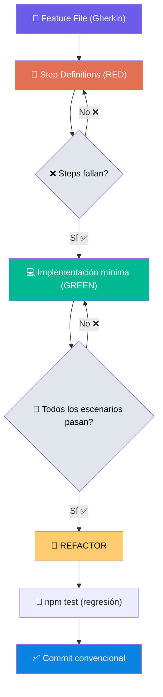

# Fase 5: Implementación BDD (RED → GREEN → REFACTOR)

**Propósito:** Implementar cada tarea siguiendo el ciclo completo de BDD con Playwright BDD.

## Ciclo BDD



## Feature File (Gherkin)

```gherkin
# features/auth/registration.feature
Feature: Registro de Usuarios
  Como un visitante
  Quiero registrarme en la aplicación
  Para poder acceder a funcionalidades protegidas

  Background:
    Given la base de datos está limpia

  @happy-path
  Scenario: Registro exitoso con datos válidos
    Given un visitante en la página de registro
    When completa el formulario con:
      | nombre | email         | contraseña |
      | Juan   | juan@test.com | Pass1234!  |
    And envía el formulario
    Then ve un mensaje "Cuenta creada exitosamente"
    And es redirigido al dashboard
```

## Step Definitions (Playwright BDD)

```typescript
// features/auth/steps/registration.steps.ts
import { createBdd } from 'playwright-bdd';
import { test, expect } from '../../playwright/fixtures';

const { Given, When, Then } = createBdd(test);

Given('un visitante en la página de registro', async ({ page }) => {
  await page.goto('/register');
});

When('completa el formulario con:', async ({ page }, dataTable) => {
  const [row] = dataTable.hashes();
  if (row.nombre) await page.fill('[name="name"]', row.nombre);
  if (row.email) await page.fill('[name="email"]', row.email);
  if (row.contraseña) await page.fill('[name="password"]', row.contraseña);
});

When('envía el formulario', async ({ page }) => {
  await page.click('button[type="submit"]');
});

Then('ve un mensaje {string}', async ({ page }, mensaje) => {
  await expect(page.getByTestId('feedback-message')).toHaveText(mensaje);
});
```

## Prerequisito: CI scaffold antes de empezar

Antes de escribir el primer Feature File, el pipeline básico de CI debe estar operativo. El objetivo es que cada commit tenga feedback inmediato y no acumular semanas de desarrollo sin barrera automatizada.

```yaml
# .github/workflows/ci.yml — scaffold mínimo al inicio de Fase 5
jobs:
  scaffold:
    runs-on: ubuntu-latest
    steps:
      - uses: actions/checkout@v4
      - uses: actions/setup-node@v4
      - run: npm ci
      - run: npm run lint
      - run: npm run build
      - run: npx vitest run   # sin coverage todavía — se exige en Fase 9
```

Este scaffold se irá endureciendo en Fase 9 (coverage, Semgrep, audit). Lo que no se hace al inicio es agregarlo al final.

## Prerequisito: logging y health endpoint antes del primer E2E

El endpoint `/api/health` y la configuración base de Pino deben estar en su lugar antes de correr los primeros tests E2E. Esto permite:
- Que los tests puedan verificar que el servicio responde y está saludable
- Que Fase 7 (testing) pueda incluir un test de smoke sobre el health endpoint
- Que la configuración de Sentry en Fase 8 tenga ya el logging en su lugar

```typescript
// src/app/api/health/route.ts — crear en el primer commit de Fase 5
export async function GET() {
  const dbOk = await checkDatabaseConnection()
  return Response.json({
    status: dbOk ? 'healthy' : 'degraded',
    timestamp: new Date().toISOString(),
    uptime: process.uptime(),
  })
}
```

## Pasos por cada tarea

1. Escribir Feature File (`.feature` en `features/`)
2. Escribir Step Definitions que fallen (RED)
3. Verificar RED: `npx bddgen && npx playwright test --grep "pendiente"`
4. Implementar código mínimo en `src/` (GREEN)
5. Verificar GREEN: todos los escenarios pasan
6. Refactorizar — tests deben seguir verdes
7. Regresión: `npm test` completo
8. Commit convencional: `feat:|fix:|refactor:`

## Gate Humano

> "Implementación completa. CI scaffold verde. ¿Revisas el PR/demo?"

✅ El humano revisa y aprueba antes de pasar a Fase 6.
