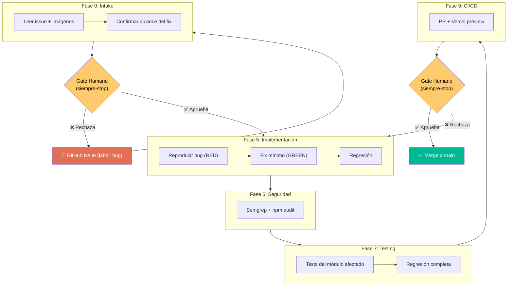

# Flujo Corto: Bug Fix y Cambios Menores

**Cuándo usar este flujo en lugar de las 11 fases:**

| Criterio | Flujo corto | 11 fases completas |
|---|---|---|
| Bug reportado (label `bug`) | ✅ | — |
| Cambio de copy o traducción | ✅ | — |
| Ajuste visual menor (spacing, color) | ✅ | — |
| Nueva feature o comportamiento | — | ✅ |
| Cambio que afecta el modelo de datos | — | ✅ |
| Cambio que afecta la arquitectura | — | ✅ |
| Cambio con implicaciones de seguridad no triviales | — | ✅ |

En caso de duda, usar las 11 fases.

---

## Fases activas en flujo corto

---

## Fase 0 — Intake del bug

1. Leer el issue: `gh issue view <número> --json title,body,labels,comments`
2. Descargar imágenes adjuntas si las hay (protocolo `/tmp/issue-<número>/`)
3. Reproducir el bug localmente antes de confirmar el alcance
4. Confirmar con el humano: *"El bug es [descripción]. El fix involucra [módulo/archivo]. ¿Procedo?"*

**Gate siempre-stop:** el humano confirma el alcance antes de tocar código.

---

## Fase 5 — Implementación del fix

El ciclo BDD aplica también para bugs:

1. **RED**: escribir un test que reproduzca el bug y falle
2. **GREEN**: implementar el fix mínimo que lo resuelve
3. **REFACTOR**: limpiar sin romper el test
4. Regresión completa: `npm test`
5. Commit: `fix: <descripción concisa>` — referencia el issue (`Closes #NNN`)

> El test que reproduce el bug es el artefacto más importante del fix. Garantiza que el bug no reaparezca.

---

## Fase 6 — Seguridad (automática)

Gates condicionales — el agente avanza si todo está verde:

- `npx semgrep --config=auto` sobre los archivos modificados
- `npm audit --audit-level=high`

Solo para si encuentra un hallazgo en el código tocado por el fix.

---

## Fase 7 — Testing (automático)

- Ejecutar la suite completa del módulo afectado
- Verificar que la cobertura no bajó respecto al estado previo al fix
- Si el fix toca múltiples módulos, regresión completa

Solo para si algún test rompe o la cobertura baja.

---

## Fase 9 — PR y Vercel Preview

1. El agente abre el PR referenciando el issue: `gh pr create ... --body "Closes #NNN"`
2. CI corre automáticamente sobre el PR
3. Vercel genera el Preview automáticamente
4. El agente reporta: *"PR #NNN abierto. CI: ✅. Preview: [URL Vercel]. Revisa el fix y dime si integro a main o lo haces tú."*

**Gate siempre-stop:** el humano revisa el preview. El merge lo hace en GitHub o le pide al agente que lo haga con `gh pr merge`. El merge a `main` dispara el deploy a producción en Vercel automáticamente.

---

## Lo que NO hace el flujo corto

| Fase omitida | Por qué |
|---|---|
| Fase 1 — SDD Spec | Un bug no requiere especificación formal |
| Fase 2 — Riesgos | El scope es acotado; el threat model no aporta valor |
| Fase 3 — Arquitectura | No hay decisiones arquitectónicas en un fix |
| Fase 4 — Tareas BDD | El fix es una sola tarea atómica |
| Fase 8 — Monitoreo | El monitoreo ya existe; el fix no cambia la infraestructura |
| Fase 10 — Documentación | El commit message + issue cerrado son documentación suficiente |

Si durante el fix se descubre que el bug tiene raíz en un problema arquitectónico o de seguridad no trivial, **escalar a las 11 fases**.
