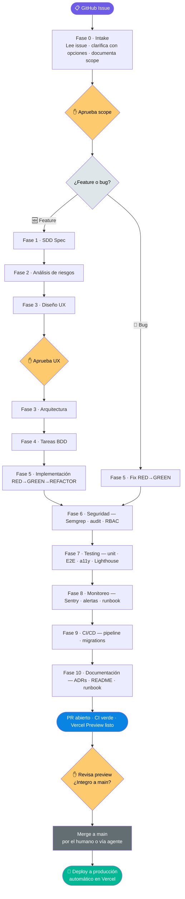

# 🏗️ Engineering Playbook — SDD + BDD Harness

Documentación viva del harness de desarrollo agéntico. Cubre el ciclo de vida completo: desde un GitHub Issue hasta un PR deployado en Vercel con seguridad, tests, monitoreo y documentación incluidos.

---

## Flujo general

---

## Qué cubre este playbook

### Ciclo de vida
| | |
|---|---|
| [🔄 Las 11 Fases](fases/README.md) | Flujo completo desde Issue hasta entrega, con gates humanos y condicionales |
| [🐛 Flujo Bug Fix](fases/flujo-bugfix.md) | Flujo corto para bugs y cambios menores (5 fases) |

### Diseño y frontend
| | |
|---|---|
| [🎨 Design System](design-system.md) | shadcn/ui, Tailwind v4, tokens CSS, tipografía, modo oscuro |
| [📐 Estándares de Diseño](estandares-diseno.md) | Regla Zero Raw HTML, Typography component, principios |
| [🧩 Patrones de Componentes](component-patterns.md) | 5 estados de página, responsive, mobile-first |
| [🏛️ Arquitectura de Componentes](components.md) | Feature-based, Server vs Client Components |
| [✨ Animaciones](animaciones.md) | Motion, Tailwind transitions, `prefers-reduced-motion` |
| [📝 Formularios](forms.md) | React Hook Form + Zod + shadcn/ui |
| [🔤 Iconos](iconos.md) | Lucide React, uso y convenciones |
| [🌍 i18n](i18n.md) | next-intl, claves de traducción, plurales |

### Backend y datos
| | |
|---|---|
| [📦 Stack Tecnológico](stack.md) | Next.js, TypeScript, Prisma, Auth.js, decisiones de stack |
| [🗄️ Database Patterns](database-patterns.md) | Prisma, queries, relaciones, índices |
| [🔄 Migraciones](migrations.md) | Estrategia expand-contract, zero-downtime |
| [🌱 Data Seeding](data-seeding.md) | Seeds de desarrollo y testing |
| [🗑️ Soft Delete](soft-delete.md) | Patrón de borrado lógico |
| [📄 Paginación](pagination.md) | Cursor-based y offset pagination |
| [💾 Caché](cache.md) | Estrategias de caching por capa |
| [🔍 Búsqueda](busqueda.md) | Full-text search, filtros |
| [⚙️ Background Jobs](background-jobs.md) | Vercel Cron, colas de tareas |

### Seguridad
| | |
|---|---|
| [🛡️ OWASP API](owasp-api.md) | Top 10 API Security, mitigaciones |
| [🔒 Security Headers](security-headers.md) | CSP, HSTS, X-Frame-Options |
| [🚦 Rate Limiting](decisiones/rate-limiting.md) | Umbrales por endpoint, estrategia |
| [🧱 CORS](cors.md) | Configuración de orígenes permitidos |
| [🔑 Sesiones](sesiones.md) | Auth.js v5, tokens, expiración |
| [⚠️ Vulnerabilidades del Stack](vulnerabilidades-stack.md) | CVEs conocidos, mitigaciones |
| [🔗 Supply Chain](supply-chain.md) | `npm audit`, dependencias seguras |

### Calidad y operaciones
| | |
|---|---|
| [🧪 Testing](testing.md) | Vitest, Playwright BDD, MSW, coverage thresholds |
| [⚠️ Error Handling](error-handling.md) | 5 capas, Error Boundary, TanStack Query, Sentry |
| [💬 Errores de Usuario](errores-usuario.md) | Mapeo técnico → mensajes amigables |
| [📊 Logging](logging.md) | Pino, logging estructurado JSON |
| [📡 Monitoreo](sentry.md) | Sentry DSN, alertas, performance traces |
| [❤️ Health Check](health-check.md) | Endpoint `/api/health`, umbrales |
| [🚀 CI/CD](fases/fase-9-cicd.md) | GitHub Actions, Vercel, pipeline completo |
| [📈 Performance Budget](performance-budget.md) | Lighthouse CI, umbrales por ruta |

### Decisiones y referencias
| | |
|---|---|
| [📋 ADRs](decisiones/adrs.md) | Architecture Decision Records |
| [📦 Dependencias](dependencies.md) | Inventario y criterios de selección |
| [💰 Costos](costos.md) | Free tier y escalado estimado |
| [🧠 Memoria Persistente](memoria.md) | pgvector, RAG, continuidad entre sesiones |

---

## Tradicional vs este harness

| Aspecto | Desarrollo tradicional | Este harness |
|---|---|---|
| **Entrada** | Descripción en chat o ticket suelto | GitHub Issue → agente lee, clarifica con opciones, documenta |
| **Especificación** | En la cabeza del developer | SDD Spec formal + scope aprobado antes de diseñar |
| **Diseño UX** | Se improvisa durante la implementación | Checklist de 7 criterios aprobado antes de escribir código |
| **Implementación** | Código directo | BDD: Gherkin primero → RED → GREEN → REFACTOR |
| **Seguridad** | Después del MVP | Day 1: Semgrep, rate limiting, Zod, RBAC, headers |
| **Testing** | Unit tests después | Unit + integración + E2E + a11y + Lighthouse CI |
| **Monitoreo** | Se configura si hay tiempo | Sentry + Pino + health check desde Fase 5 |
| **Deploy** | Manual o script propio | PR → Vercel preview automático → merge a main |
| **Documentación** | README desactualizado | ADRs desde la decisión + living docs (BDD features) |
| **Bugs** | Issue → fix → deploy | Flujo corto: reproduce → test RED → fix → PR con preview |

---

> **Filosofía:** Toda solicitud entra por un GitHub Issue. El agente la lee, clarifica con opciones concretas, y ejecuta el flujo correspondiente. Nada se implementa sin antes estar especificado y acordado. Nada llega a producción sin tests, seguridad y un PR revisado por el humano.
